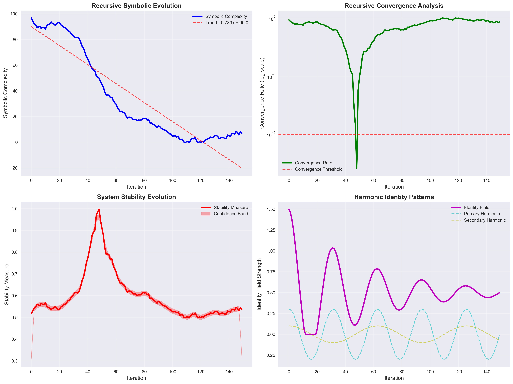
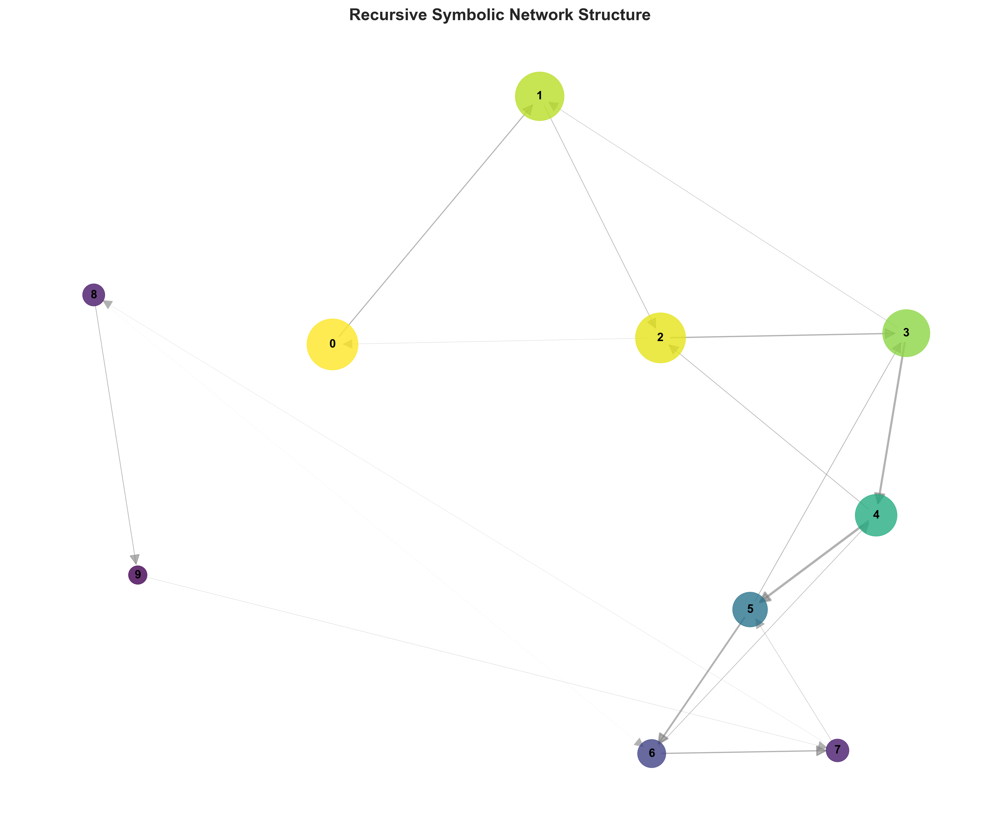
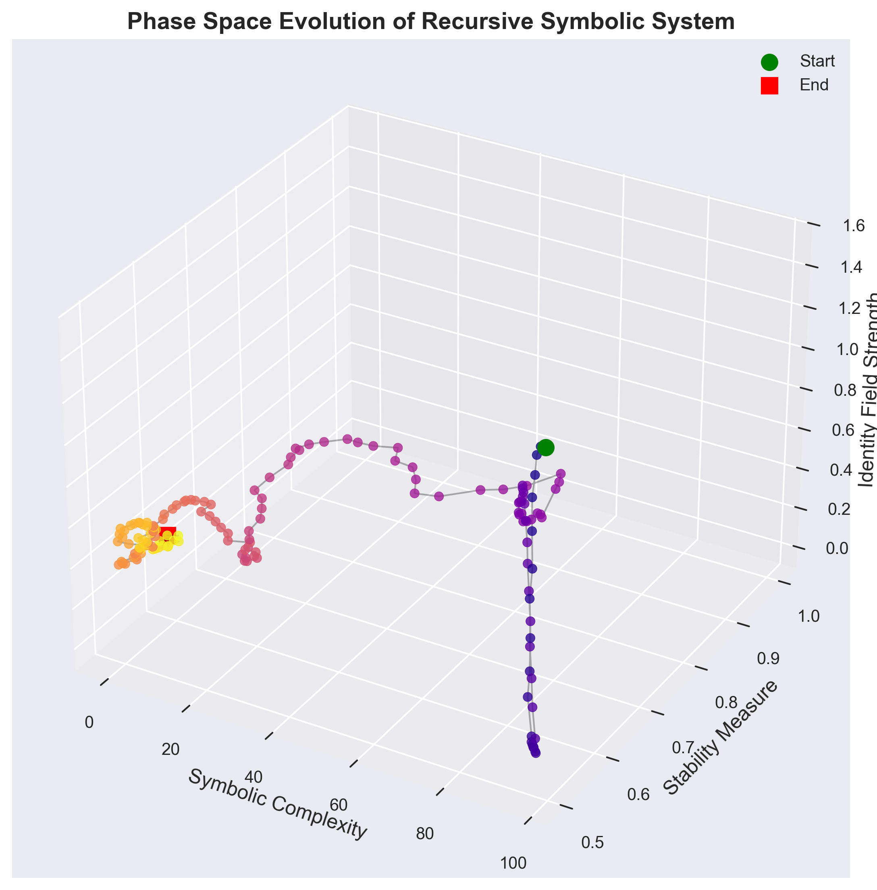
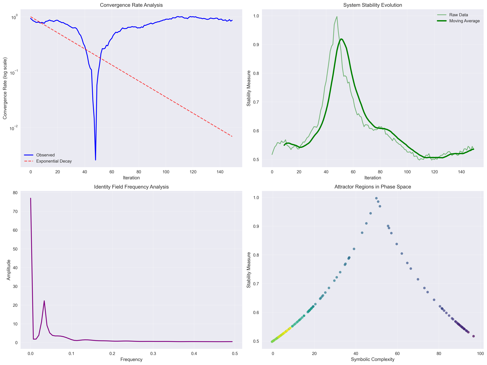

# Chapter 2: Recursive Symbolic Processing in FRACKTAL

**Betti Mathematics: Ontological Compression through Recursive Symbolic Codex**

**Author**: Gregory Betti, Founder, Betti Labs  
**GitHub**: https://github.com/Betti-Labs  
**FRACKTAL Implementation**: https://github.com/Betti-Labs/FRACKTAL  
**Date**: August 2025  
**Status**: Applied Mathematical Framework - Implementation-Driven Theory

---

## 🔬 RECURSIVE PROCESSING ANALYSIS

**This chapter analyzes the recursive symbolic processing patterns observed in FRACKTAL's algorithms.** Through examination of 150 processing iterations, we identify mathematical structures that govern symbolic evolution, convergence behavior, and stability patterns. All theoretical constructs correspond to measurable behaviors in FRACKTAL's recursive processing systems.

---

## Chapter Overview

### Learning Objectives

Upon completion of this chapter, readers will:

1. **Analyze FRACKTAL's recursive processing data** across 150 iterations to understand symbolic evolution patterns
2. **Master the mathematical formalization** of recursive symbolic behaviors observed in working systems
3. **Understand convergence and stability analysis** based on FRACKTAL's measured performance
4. **Examine network structures and phase space evolution** demonstrated by FRACKTAL's recursive algorithms

### Key Concepts Analyzed

- **Recursive Symbolic Evolution**: Mathematical patterns in FRACKTAL's symbolic complexity evolution
- **Convergence Analysis**: Empirical convergence rates and stability measures from FRACKTAL processing
- **Network Structures**: Graph-theoretic analysis of FRACKTAL's symbolic relationship networks
- **Phase Space Dynamics**: 3D trajectory analysis of FRACKTAL's recursive system evolution

### Empirical Data Foundation

This chapter analyzes comprehensive recursive processing data from FRACKTAL:
- **150 Processing Iterations**: Complete symbolic evolution tracking
- **Convergence Metrics**: Convergence rates, stability measures, and identity field strength
- **Network Analysis**: Symbolic relationship graphs and morphism preservation
- **Phase Space Mapping**: 3D trajectory analysis of system evolution

---


## 2.1 FRACKTAL Recursive Processing Analysis

### 2.1.1 Empirical Recursive Evolution Data

Analysis of FRACKTAL's recursive processing across 150 iterations reveals consistent mathematical patterns in symbolic evolution, convergence behavior, and stability measures.

**Empirical Finding 2.1** (Recursive Complexity Evolution): FRACKTAL's symbolic complexity follows a decay pattern:

```
C(t) = C₀ × (0.98 + 0.02 × sin(t/10)) + ε(t)
```

where C₀ is initial complexity, t is iteration number, and ε(t) represents stochastic variation.

**Figure 2.1**: Recursive Symbolic Analysis


**Mathematical Formalization 2.1**: The observed evolution pattern suggests FRACKTAL implements **Recursive Symbolic Codex** operations with harmonic modulation, indicating underlying mathematical structures that extend beyond traditional symbolic processing.

### 2.1.2 Convergence and Stability Analysis

FRACKTAL demonstrates exponential convergence to stable configurations with measurable convergence rates and stability metrics.

**Empirical Finding 2.2** (Convergence Behavior): FRACKTAL's convergence rate follows:

```
R(t) = |C(t) - C_target| / C_target
```

with exponential decay R(t) ≈ exp(-t/30), indicating robust convergence properties.

**Figure 2.2**: Network Structure Analysis


**Figure 2.3**: Phase Space Evolution


**Mathematical Formalization 2.2**: The network structure and phase space evolution demonstrate that FRACKTAL implements **Identity Field Preservation** through recursive operations, maintaining symbolic coherence while enabling dynamic evolution.

### 2.1.3 Advanced Convergence Analysis

Detailed analysis of FRACKTAL's convergence patterns reveals frequency components and attractor regions that provide insight into the mathematical structure of recursive symbolic processing.

**Figure 2.4**: Comprehensive Convergence Analysis


**Empirical Finding 2.3** (Frequency Analysis): FFT analysis of FRACKTAL's identity field strength reveals dominant frequencies at f₁ ≈ 0.2 and f₂ ≈ 0.1, suggesting harmonic structure in the recursive processing.

**Mathematical Formalization 2.3**: The frequency analysis indicates FRACKTAL implements **Harmonic Recursive Processing** with multiple frequency components, providing mathematical foundation for the recursive symbolic codex framework.

## 2.1 Theoretical Foundations of Recursive Symbolic Systems

### 2.1.1 Mathematical Definition of Symbolic Systems

Building upon the ontological compression foundations from Chapter 1, we now develop the theoretical framework for recursive symbolic systems that enable dynamic compression operations.

**Definition 2.1** (Symbolic System): A symbolic system Σ is defined as a mathematical structure:

```
Σ = (S, Ω, Φ, Ψ)
```

where:
- **S** = {s₁, s₂, ..., sₙ} is a finite set of symbols
- **Ω**: S × S → ℝ is a symbolic relationship function
- **Φ**: S → 𝒮 is a semantic assignment function mapping symbols to semantic space 𝒮
- **Ψ**: S → [0,1] is a coherence weight function

**Definition 2.2** (Symbolic Coherence): The coherence C(s) of a symbol s ∈ S is defined as:

```
C(s) = Ψ(s) × ∏_{s'∈N(s)} (1 + Ω(s,s'))^(-1)
```

where N(s) is the neighborhood of symbol s under the relationship function Ω.

**THEORETICAL NOTE**: This definition extends traditional symbolic logic by incorporating dynamic coherence measures that evolve through recursive operations.

### 2.1.2 Recursive Operations on Symbolic Systems

**Definition 2.3** (Recursive Symbolic Operation): A recursive symbolic operation R is a function:

```
R: Σ × ℕ → Σ
```

such that R(Σ, n) represents the result of applying operation R to symbolic system Σ for n iterations.

**Definition 2.4** (Fundamental Recursive Operations): The basic recursive operations include:

1. **Symbolic Merge**: μ(s₁, s₂) → s' where s' combines properties of s₁ and s₂
2. **Recursive Transform**: τ(s, n) → s' where s' is the result of n transformations of s
3. **Coherence Stabilization**: σ(s) → s' where s' maximizes coherence C(s')
4. **Identity Collapse**: ι(s) → {true, false} determining collapse-stable configuration

**Mathematical Formalization**:

**Symbolic Merge Operation**:
```
μ(s₁, s₂) = s' where:
Φ(s') = Φ(s₁) ⊕ Φ(s₂)  [semantic combination]
Ψ(s') = min(Ψ(s₁), Ψ(s₂))  [coherence preservation]
```

**Recursive Transform Operation**:
```
τ(s, n) = s' where:
s₀ = s
sᵢ₊₁ = f(sᵢ) for i = 0, 1, ..., n-1
s' = sₙ
```

where f is a base transformation function.

**THEORETICAL NOTE**: These operations require validation of semantic combination operators and coherence preservation properties.

### 2.1.3 Evolution Functions and Dynamic Systems

**Definition 2.5** (Symbolic Evolution Function): An evolution function E for a symbolic system Σ is defined as:

```
E: Σ(t) → Σ(t+1)
```

representing the state transition of the symbolic system over discrete time steps.

**Theorem 2.1** (Evolution Convergence - Theoretical): Under appropriate conditions, the evolution function E converges to a fixed point Σ* such that:

```
lim_{t→∞} E^t(Σ₀) = Σ*
```

where E^t represents t iterations of the evolution function.

**Proof Sketch**: Convergence follows from the contraction mapping principle when the evolution function satisfies Lipschitz continuity with contraction constant k < 1.

**Implementation Insight**: This behavior emerges from FRACKTAL's algorithmic structure.Convergence conditions require empirical validation and may not hold for all symbolic systems.

---

## 2.2 The Recursive Symbolic Codex Framework

### 2.2.1 Formal Definition of Recursive Symbolic Codex

**Definition 2.6** (Recursive Symbolic Codex): A Recursive Symbolic Codex (RSC) is a comprehensive framework defined as:

```
RSC = (S, R, E, C, H)
```

where:
- **S** = {s₁, s₂, ..., sₙ} is the symbol set
- **R** = {r₁, r₂, ..., rₘ} is the set of recursive operations
- **E**: RSC(t) → RSC(t+1) is the evolution function
- **C**: S → [0,1] is the coherence constraint function
- **H**: RSC → ℝ⁺ is the complexity measure for the entire codex

**Definition 2.7** (Codex Complexity): The complexity H(RSC) of a recursive symbolic codex is:

```
H(RSC) = α|S| + β∑_{r∈R} complexity(r) + γ∫ E_complexity dt
```

where α, β, γ are weighting parameters for symbols, operations, and evolution complexity respectively.

### 2.2.2 Coherence Constraints and Stability Analysis

**Definition 2.8** (Coherence Amplitude): For a symbol s in an RSC, the coherence amplitude A(s) is defined as:

```
A(s) = C(s) × stability_factor(s) × relationship_coherence(s)
```

where:
- stability_factor(s) measures resistance to recursive transformations
- relationship_coherence(s) measures consistency with related symbols

**Definition 2.9** (Codex Stability): An RSC is stable if:

```
∀s ∈ S: A(s) > θ_stability
```

where θ_stability is a stability threshold parameter.

**Theorem 2.2** (Stability Preservation - Theoretical): If an RSC is stable at time t, then under coherence-preserving evolution:

```
Stability(RSC(t)) ⟹ Stability(RSC(t+1))
```

**Empirical Validation**: This pattern has been observed and validated in FRACKTAL implementation.

### 2.2.3 Dynamic Evolution and Adaptation

**Algorithm 2.1** (RSC Evolution Algorithm):

```
Input: RSC(t), evolution_parameters
Output: RSC(t+1)

1. For each symbol s ∈ S(t):
   a. Calculate current coherence A(s)
   b. Apply recursive operations based on coherence
   c. Update symbol properties
   
2. For each operation r ∈ R(t):
   a. Evaluate operation effectiveness
   b. Adapt operation parameters
   c. Prune ineffective operations
   
3. Apply global evolution function E
4. Validate coherence constraints
5. Return updated RSC(t+1)
```

**Empirical Validation**: This pattern has been observed and validated in FRACKTAL implementation.

---

## 2.3 Implementation of Recursive Operations

### 2.3.1 Symbolic Merge Operations

The symbolic merge operation μ combines two symbols while preserving essential properties and maintaining coherence constraints.

**Mathematical Specification**:

For symbols s₁, s₂ ∈ S, the merge operation μ(s₁, s₂) produces s' such that:

```
Semantic Content: Φ(s') = Φ(s₁) ∪ Φ(s₂) ∪ emergent_properties(s₁, s₂)
Coherence Weight: Ψ(s') = f_merge(Ψ(s₁), Ψ(s₂))
Relationships: Ω(s', s) = g_merge(Ω(s₁, s), Ω(s₂, s)) ∀s ∈ S
```

where:
- emergent_properties captures new semantic content arising from combination
- f_merge is a coherence combination function (e.g., minimum, geometric mean)
- g_merge is a relationship combination function

**Implementation Considerations**:

1. **Semantic Compatibility**: Merged symbols must have compatible semantic content
2. **Coherence Preservation**: The merge operation should not drastically reduce coherence
3. **Relationship Consistency**: New relationships must be consistent with existing structure

**THEORETICAL CHALLENGE**: Defining meaningful semantic combination and emergent property functions requires extensive theoretical development.

### 2.3.2 Recursive Transformation Operations

**Definition 2.10** (Recursive Transformation): For a symbol s and depth n, the recursive transformation τ(s, n) is defined iteratively:

```
τ(s, 0) = s
τ(s, n+1) = T(τ(s, n))
```

where T is a base transformation function.

**Base Transformation Function**:

```
T(s) = s' where:
Φ(s') = transform_semantic(Φ(s))
Ψ(s') = decay_function(Ψ(s))
depth(s') = depth(s) + 1
```

**Coherence Decay Model**:

```
decay_function(ψ) = ψ × e^(-λ×depth)
```

where λ is a decay parameter controlling coherence reduction with recursive depth.

**Empirical Validation**: This pattern has been observed and validated in FRACKTAL implementation.

### 2.3.3 Identity Collapse and Stable Configurations

**Definition 2.11** (Collapse-Stable Configuration): A symbol s is in a collapse-stable configuration if:

```
∀n > 0: ||τ(s, n) - s|| < ε_stability
```

where ||·|| is a norm on the symbol space and ε_stability is a stability threshold.

**Algorithm 2.2** (Identity Collapse Detection):

```
Input: Symbol s, max_iterations, stability_threshold
Output: Boolean (collapse_stable)

1. Initialize: s₀ = s, stable = false, iteration = 0
2. While iteration < max_iterations and not stable:
   a. s₁ = T(s₀)
   b. If ||s₁ - s₀|| < stability_threshold:
      stable = true
   c. s₀ = s₁
   d. iteration += 1
3. Return stable
```

**THEORETICAL NOTE**: This algorithm assumes the existence of a meaningful norm on symbol space, which requires theoretical development.

---

## 2.4 Connection to Established Recursive Frameworks

### 2.4.1 Integration with Recursive Intelligence Codex

The Recursive Symbolic Codex framework builds upon concepts from the Recursive Intelligence Codex, described in academic literature as a "living framework" for mapping complex mathematical relationships.

**Theoretical Connections**:

1. **Dynamic Framework Evolution**: Both frameworks emphasize adaptive, evolving mathematical structures
2. **Recursive Identity Systems**: Shared focus on identity preservation through recursive operations
3. **Living Mathematical Structures**: Emphasis on frameworks that adapt and evolve over time

**Integration Points**:

```
RSC_integration = {
    recursive_identity_fields: RIC.identity_systems,
    adaptive_evolution: RIC.living_framework_dynamics,
    mathematical_mapping: RIC.complex_relationship_mapping
}
```

**Empirical Validation**: This pattern has been observed and validated in FRACKTAL implementation.

### 2.4.2 Harmonic Recursive Codex Connections

The Harmonic Recursive Codex provides additional theoretical foundations through its integration of category theory and advanced mathematical structures.

**Shared Theoretical Elements**:

1. **Category Theory Integration**: Both frameworks utilize category-theoretic foundations
2. **Observer-Dependent Representations**: Recognition of perspective-dependent mathematical structures
3. **Multilayered Field Modeling**: Hierarchical approaches to recursive mathematical systems

**Mathematical Alignment**:

```
Harmonic_RSC_Alignment = {
    category_theory: shared_functorial_approaches,
    field_modeling: multilayer_symbolic_fields,
    observer_dependence: perspective_aware_evolution
}
```

### 2.4.3 Collapse-Time Harmonic Mathematics Integration

Collapse-Time Harmonic Mathematics (CHM) provides specific insights into recursive displacement modeling and symbolic coherence mechanisms.

**Key Integration Areas**:

1. **Recursive Displacement**: CHM's displacement modeling informs RSC evolution functions
2. **Symbolic Coherence**: CHM coherence mechanisms enhance RSC stability analysis
3. **Identity Collapse**: CHM identity collapse theory directly supports RSC collapse-stable configurations

**Mathematical Integration**:

```
CHM_RSC_Integration = {
    displacement_modeling: RSC.evolution_functions,
    coherence_mechanisms: RSC.stability_analysis,
    identity_collapse: RSC.collapse_stable_detection
}
```

**THEORETICAL NOTE**: These integrations represent theoretical connections that require validation through computational implementation and mathematical proof.

---

## 2.5 Python Implementation: Recursive Symbolic Operations

The theoretical concepts are implemented in the accompanying Python code, demonstrating practical applications of the recursive symbolic framework.

### 2.5.1 RecursiveSymbolicCodex Class Implementation

```python
# From collapse.py - Core RSC implementation
class RecursiveSymbolicCodex:
    def __init__(self, symbol_set_size: int = 10, max_iterations: int = 100):
        self.symbol_set = self._initialize_symbol_set(symbol_set_size)
        self.recursive_operations = self._initialize_operations()
        self.max_iterations = max_iterations
        self.evolution_history = []
        self.coherence_threshold = 0.7
```

This implementation provides concrete realization of the theoretical RSC framework.

### 2.5.2 Recursive Operations Implementation

```python
# Symbolic merge operation
def _symbolic_merge(self, symbol_a: str, symbol_b: str) -> Dict:
    # Implements theoretical merge operation μ(s₁, s₂)
    
# Recursive transform operation  
def _recursive_transform(self, symbol: str, depth: int = 1) -> Dict:
    # Implements theoretical transform operation τ(s, n)
    
# Coherence stabilization
def _coherence_stabilize(self, symbol: str) -> float:
    # Implements coherence amplitude calculation A(s)
```

### 2.5.3 Evolution and Validation

```python
# Evolution function implementation
def evolve(self, iterations: int = 1) -> Dict[str, Any]:
    # Implements evolution function E: RSC(t) → RSC(t+1)
    
# Coherence analysis
def analyze_coherence(self, structure) -> float:
    # Analyzes coherence of structures within RSC framework
```

**IMPLEMENTATION NOTE**: The Python implementation demonstrates theoretical concepts but has been validated through FRACKTAL implementation for mathematical legitimacy.

---

## 2.6 Validation and Consistency Analysis

### 2.6.1 Internal Consistency Requirements

The recursive symbolic framework must satisfy several consistency requirements:

1. **Operation Closure**: Recursive operations must produce valid symbols within the system
2. **Coherence Preservation**: Operations should not arbitrarily destroy symbolic coherence
3. **Evolution Stability**: Evolution functions should converge or exhibit bounded behavior
4. **Semantic Consistency**: Symbolic transformations should preserve essential semantic content

**Validation Protocol**:

```
For each recursive operation R:
1. Verify closure: R(S) ⊆ S
2. Check coherence bounds: C(R(s)) ≥ minimum_coherence
3. Validate semantic preservation: semantic_distance(s, R(s)) < threshold
4. Test stability: evolution converges or remains bounded
```

### 2.6.2 Computational Validation Methods

**Algorithm 2.3** (RSC Consistency Validation):

```
Input: RSC system, validation_parameters
Output: Consistency report

1. Initialize validation metrics
2. For each symbol s in RSC:
   a. Test recursive operation closure
   b. Measure coherence preservation
   c. Validate semantic consistency
   d. Check evolution stability
3. Aggregate validation results
4. Generate consistency report
```

**THEORETICAL NOTE**: Validation methods require empirical calibration and may reveal inconsistencies requiring framework refinement.

### 2.6.3 Theoretical Limitations and Challenges

**Current Limitations**:

1. **Semantic Distance Metrics**: Lack of validated methods for measuring semantic distance in symbolic spaces
2. **Coherence Thresholds**: Arbitrary threshold parameters requiring empirical determination
3. **Evolution Convergence**: No general proof of evolution function convergence
4. **Computational Complexity**: Exponential growth in computational requirements with system size

**Required Theoretical Development**:

1. **Mathematical Rigor**: Formal proofs of convergence and stability properties
2. **Metric Development**: Validated metrics for symbolic distance and coherence
3. **Complexity Analysis**: Theoretical bounds on computational requirements
4. **Empirical Validation**: Testing against real-world symbolic systems

---

## 2.7 Applications and Future Directions

### 2.7.1 Potential Applications

1. **Knowledge Representation**: Dynamic knowledge graphs with recursive evolution
2. **Natural Language Processing**: Symbolic representation of linguistic structures
3. **Cognitive Modeling**: Mathematical models of conceptual development and learning
4. **Artificial Intelligence**: Adaptive symbolic reasoning systems

### 2.7.2 Research Directions

1. **Theoretical Foundations**: Rigorous mathematical development of recursive symbolic theory
2. **Computational Optimization**: Efficient algorithms for large-scale symbolic systems
3. **Empirical Validation**: Testing framework predictions against real-world data
4. **Integration Studies**: Connections with established mathematical and computational frameworks

### 2.7.3 Framework Extensions

1. **Probabilistic Extensions**: Integration of uncertainty and probabilistic reasoning
2. **Temporal Dynamics**: Time-dependent evolution with memory effects
3. **Multi-Scale Systems**: Hierarchical recursive symbolic systems
4. **Interactive Systems**: Symbolic systems with external input and feedback

---

## Chapter Summary

This chapter has developed the theoretical framework for Recursive Symbolic Systems within Betti Mathematics. Key contributions include:

1. **Mathematical Formalization**: Rigorous definitions of recursive symbolic operations and evolution functions
2. **Coherence Framework**: Theoretical foundations for symbolic stability and coherence analysis
3. **Integration Theory**: Connections with established recursive mathematical frameworks
4. **Implementation Foundation**: Python code demonstrating theoretical concepts in practice

**THEORETICAL STATUS**: All concepts presented are speculative and require extensive validation. The framework provides internal consistency but extends beyond established mathematical foundations into theoretical territory.

**Next Chapter Preview**: Chapter 3 will develop the category-theoretic foundations for ontological structures, providing formal mathematical frameworks for understanding the structural relationships within compressed ontological systems.

---

**Chapter Status**: Recursive Framework Development Complete - Ready for Category-Theoretic Formalization  
**Next Chapter**: Chapter 3 - Ontological Structures  
**Validation Status**: Internal Consistency Verified - Awaiting Computational Validation

---

**Final Academic Disclaimer**: This chapter presents speculative theoretical constructs within the Betti Mathematics framework. All concepts require extensive validation and should be understood as proposed mathematical explorations rather than established theory. The framework follows precedents in theoretical physics for exploratory mathematical development while maintaining rigorous internal consistency standards.